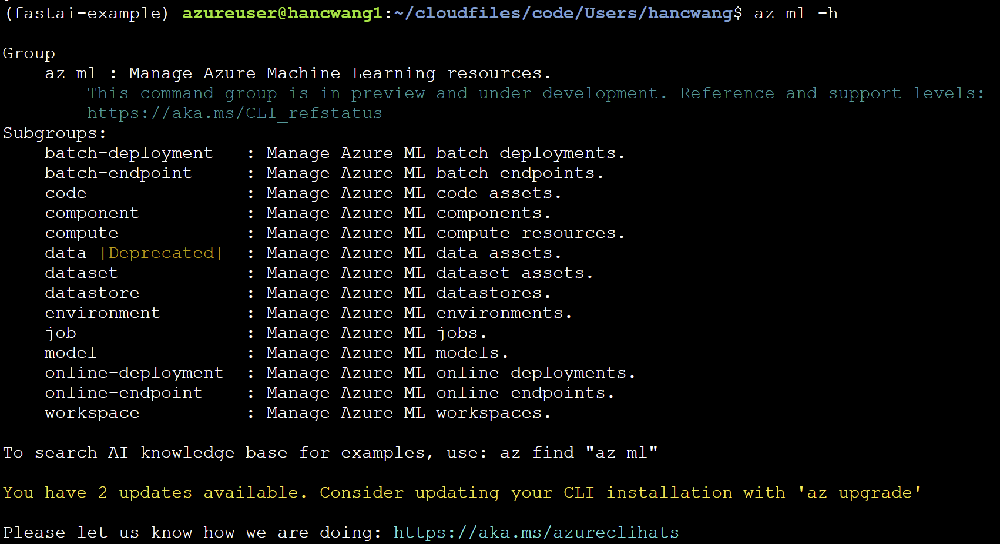

# AzureML CLI v2 workshop

Welcome to the CLI v2 workshop! The ml extension v2 to the Azure CLI is the enhanced interface for Azure Machine Learning. It enables you to train and deploy models from the command line, with features that accelerate scaling data science up and out while tracking the model lifecycle.

In this workshop, you'll learn how to set up a conda environment on an AzureML compute instance, train a deep learning model to recognize hand written digits(MNIST dataset) and inference the trained model.

If you haven't done so, please follow steps in [setup.md](./setup.md) to setup your environment.

## Training

### Basic commands

Good job on finishing up the environment setup! Let's run some basics commands to get familiar with Azure CLI and ml extention.

To check on the just installed AzureML extension v2, you can list extensions by,

```bash
az extension list
```

You should see `ml` listed as one item in the list, latest version of the extention is `2.1.2`.

Let's also look at the high level structure of the extension by running,

```bash
az ml -h
```

Which lists subgroups of the `ml` extension. Each subgroup is corresponding to one AzureML resource that customers can manage.



If this is a workspace you have used in the past, you likely will get something if you run

```bash
az ml dataset list
```

or

```bash
az ml model list
```

### Display the training dataset

Now let's take a look at the dataset we'll be using for this training.

TODO: instructions on opening the sample notebook. Anything needs to be installed to run the notebook? FastAI?

### Run training code on the compute instance

`train.py` in the `fastai` folder contains the training code. We can look at the code together. One thing to note is that the code doesn't have any AzureML SDK dependencies, but it's still capable of using AzureML services as tracking server and logging metrics, models and artifacts to your AzureML workspace. You'll see this in the next step.

You already have dependencies installed in your conda environment, you should be able to just run the training code directly.

```bash
 python train.py
```

TODO: does local run register a model?

Although the training happened locally on the CI, you'll see a run created for the training under `Default` experiment, you'll also see logs, metrics and model created for the training.

The same thing will happen even if you run the training code on your laptop or desktop, as long as you have `azureml-mlflow` installed in your conda environment. What happens is that `azureml-mlflow` sets AzureML as the mlflow tracking server, metrics and assets generated by the training are logged to AzureML.

### Train remote

Now let's look at how to submit the training job to a different (more powerful) AzureML compute cluster.

Create a new or pick an existing AzureML compute cluster on AzureML portal. Remember the cluster name.


Set the Azure CLI default subscription to the current subscription. Sometime you get a wrong subscription when you firstly logged in with Azure CLI.

```bash
az account set --subscription <the-sub-id-of-your-ws>
```

Submit an AzureML training job using `azureml-job.yml` configuration file. We can look at the yaml file together. This is one of the most important if not the most important features of AzureML CLI v2. Customers can capture their jobs, assets, resources configuration in yaml files, store or share the files or simply reuse the files for repeatability.

Update the `compute` field in the yaml file to match your AzureML compute cluster name. The name needs to be prefixed with `azureml:`.

```bash
az ml job create -f azureml-job.yml
```

## Inferencing

After model is trained and registered (done in the training script) we will start with inferencing.
### Deploy local
To deploy a model locally run the below command on the terminal.

```bash
mlflow models serve --model-uri models:/ElasticnetWineModel/1
```

The command above will deploy model `ElasticWineModel` version `1` locally as local REST API endpoint. Default port used is 5000.

Screenshot below show that local endpoint is up and running


Now we can use `http://localhost:5000/invocations` endpoint to do some inferencing locally. Yuppiieeee .....

Lets run an inference request
```python
import requests

inference_request = {
    "columns": [
        "alcohol",
        "chlorides",
        "citric acid",
        "density",
        "fixed acidity",
        "free sulfur dioxide",
        "pH",
        "residual sugar",
        "sulphates",
        "total sulfur dioxide",
        "volatile acidity",
    ],
    "data": [[7.4,0.7,0,1.9,0.076,11,34,0.9978,3.51,0.56,9.4]],
}

endpoint = "http://localhost:5000/invocations"
response = requests.post(endpoint, json=inference_request)

response.json()
```

### Deploy remote

[Managed endpoints](https://techcommunity.microsoft.com/t5/ai-machine-learning-blog/announcing-managed-endpoints-in-azure-machine-learning-for/ba-p/2366481) is an AzureML product that manages the inferencing infrastructure for customers, so that they can focus on their business logic.

TODO: How does the audience get the trained model? Check it into the repo?

There're 2 concepts need to be explained for people who might not be familiar with how inferencing works, endpoint and deployment. An endpoint is like a server customers can call with input data to get a prediction. The endpoint is also like a load balancer where there can be multiple deployments behind it. Each deployment has different configuration on which model to use, what's the environment and how to invoke the model to get the prediction result. We can look at the endpoint yaml and deployment yaml file together.

To create an MIR endpoint,

```bash
az ml online-endpoint create -f ./mir.yml
```

To create an MIR deployment,

```bash

```
