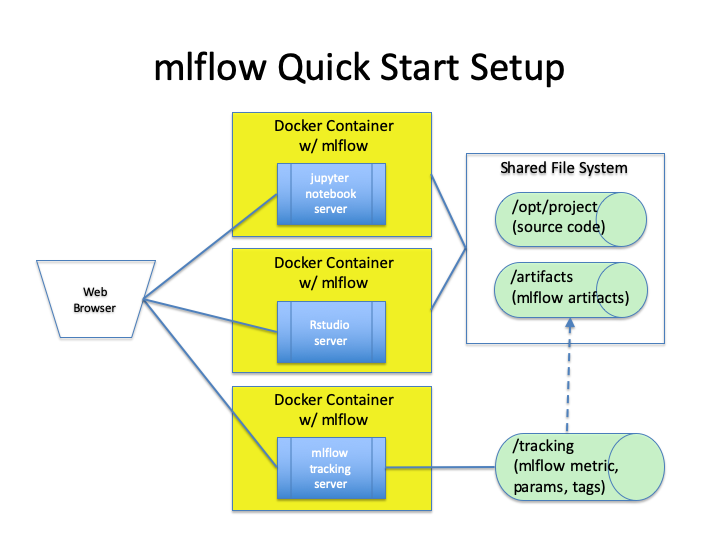

# mlflow Quickstart

## Quickstart Environment


## System Requirements
* [Docker](https://docs.docker.com/develop/)
* [Docker Compose](https://docs.docker.com/compose/overview/)

## Environment Setup

### Set up local storage
* `git clone` `mlflow` repo to local storage.  Note directory for the local repo, 
e.g., `/fully-qualified-path-to-local-repo/mlflow`
* Create directory to hold mlflow tracking data and artifacts, e.g., `/fully-qualified-path-to-local-directory/tracking-artifacts`.  
Within this directory create these subdirectories
```
/fully-qualified-path-to-local-directory/tracking-artifacts/tracking
/fully-qualified-path-to-local-directory/tracking-artifacts/artifacts
```

### Setup required environment variables
* Change working directory to `examples/quickstart`
* Update contents of `./setup_environment_variables` to specify values for the required environment variables.
```
MLFLOW_VERSION
MLFLOW_VERSION_TO_INSTALL
MFLOW_EXAMPLE_DIRECTORY
MLFLOW_TRACKING_DIRECTORY
MLFLOW_TRACKER_URI
MLFLOW_BACKEND_STORE
```
 
Specify version of mlflow package.  See example below.
```
###
# Set up environment variables to control building and
# running demonstration mlflow Docker containers
###

# mlflow version to install
export MLFLOW_VERSION=0.9.1

# directory containing demonstration source code
export MLFLOW_EXAMPLE_DIRECTORY=/fully-qualified-path-to-local-repo/mlflow/examples/quickstart/sample_code

# directory to hold mlflow tracking and artifacts
export MLFLOW_TRACKING_DIRECTORY=/fully-qualified-path-to-local-directory/tracking-artifacts

# mflow tracking server URI
export MLFLOW_TRACKING_URI=http://mlflow_tracker:5000

# backend store for mlflow tracking server within the container
export MLFLOW_BACKEND_STORE=/tracking

# pip install specification for mlflow
export MLFLOW_VERSION_TO_INSTALL="mlflow==${MLFLOW_VERSION}"
```

### Build the required mlflow Docker images
* After updating `setup_environment_variables`, execute following command to set  
environment variables: `. ./setup_environment_variables`

* Run the following command to build the required Docker images.
```
bash ./build_images.sh
```
Note:  On a MacbookPro with 16GB RAM, it takes 10 to 13 minutes for the initial 
build of the images.


## Running the mflow platform containers
After building the Docker images, navigate to `examples/quickstart`.  Correct execution of the specified commands 
depend on the `examples/quickstart` is the current working directory.

Ensure the required environment variables are defined by running `. ./setup_environment_variables`.

* Start the Docker containers:
```
docker-compose up --detach
```
* Confirm that the containers started successfully, run the following command.  
```
docker-compose ps
```

Your output should look similar to this
```
           Name                          Command               State           Ports
---------------------------------------------------------------------------------------------
quickstart_jpynb_1            /usr/bin/tini -- jupyter n ...   Up      0.0.0.0:8888->8888/tcp
quickstart_mlflow_tracker_1   /usr/bin/tini -- mlflow se ...   Up      0.0.0.0:5000->5000/tcp
quickstart_rstudio_1          /init                            Up      0.0.0.0:8787->8787/tcp
```

* Stop the Docker containers:
```
docker-compose down
```

## Connecting to containers
Open a browser and enter the following URL for the respective service.

|Service|URL|
|-------|---|
|Python Jupyter Notebook Server (jpynb)| `http://0.0.0.0:8888`|
|RStudio Server (rstudio)|`http://0.0.0.0:8787`|
|mlflow tracking server|`http://0.0.0.0:5000`|


## Limittions

* _Setup described in this section does not consider security requirements and is suitable only 
for demonstration purposes with non-sensitive data.  Changes are required for any production deployment_.
* Use of `docker-compose` limits containers to run on a single node only.