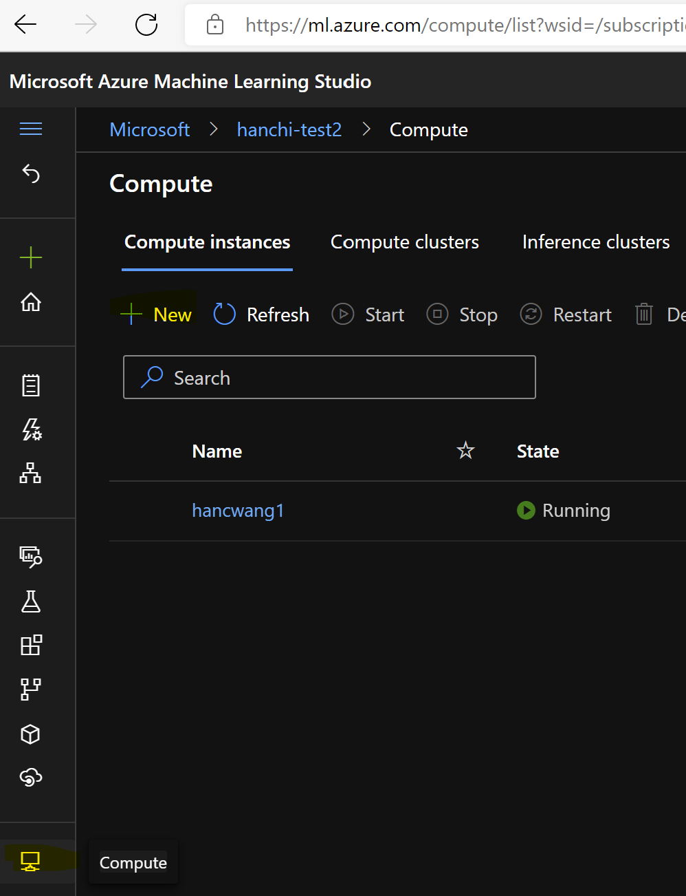

# AzureML CLI v2 workshop setup

This is the environment setup instructions for the CLI v2 workshop

## Create an AzureML compute instance as your environment

Pick a test workspace of your choice, create a compute instance. It's recommended to create a new compute instance even if you already have one. This is to ensure your compute instance has all latest feature and have the same configuration as expected in this workshop.



## Clone the mlflow repository

Code of this worship is checked into a forked mlflow GH repo. After the git setup above, run below command to clone the repo

```bash
git clone https://github.com/luigiw/mlflow.git
```

## Create a conda environment

Conda environments create isolated Python environments for easy dependency management. We'll create a new conda environment using configuration provided by mlflow in this workshop.

Cd into the mlflow fastai example folder.

```bash
cd ./mlflow/examples/fastai
```

`conda.yaml` is the configuration file you use to create the new conda environment. `conda.yaml` specifies dependencies like `mlflow`, `fastai` and `azureml-mlflow` that are needed for this workshop. When you create the conda environment, you'll see each of the depending package installed.

Run this command to create the conda environment, name of the environment is `fastai-example`

```bash
conda env update --file ./conda.yaml
```

Activate the environment by,

```bash
conda activate fastai-example
```

Run the below commands to allow conda env to show up among the list of kernels in jupyter notebook
```bash
conda install -c anaconda ipykernel
python3 -m ipykernel install --user --name=fastai-example
```

Install widgets for visualizations
```bash
pip3 install ipywidgets
```

## Install AzureML CLI extension v2

Compute instances have Azure CLI and AzureML v1 extension installed out of box. AzureML extention v2 is needed for this workshop. To remove the v1 extension and install the v2 extension run,

```bash
az extension remove -n azure-cli-ml && az extension add -n ml -y
```

You've now finished the environment setup for the CLI v2 workshop.
