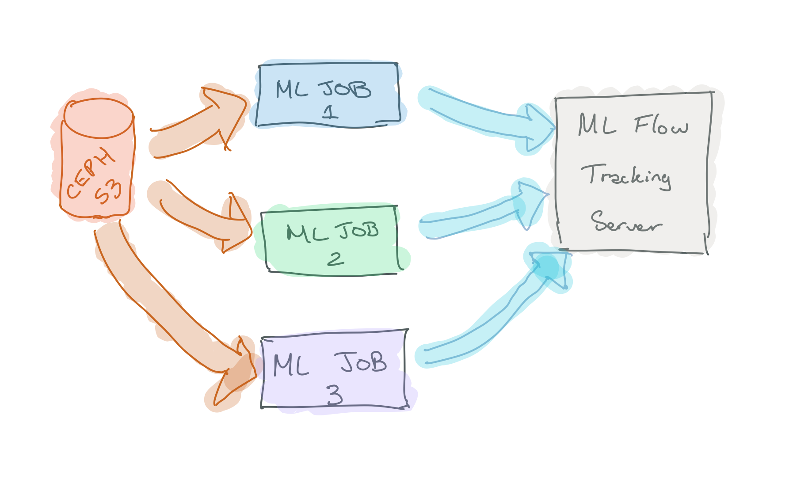
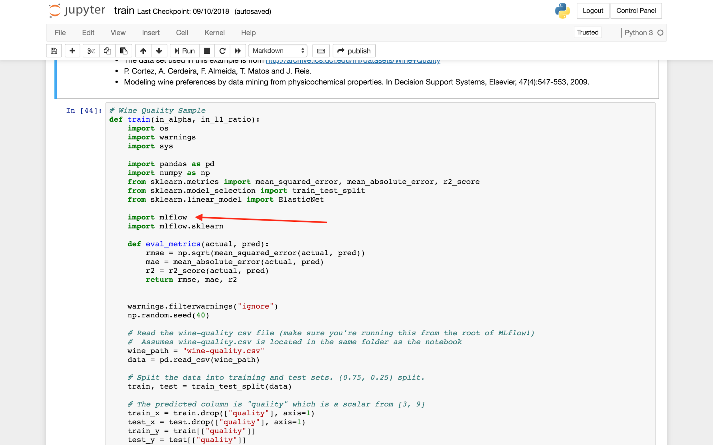

# MLFlow Tracking Server Operator

## Overview

In this repository we are providing our data scientists with tooling to perform hyper
parameter tuning with  Kubernetes/OpenShift. Our business requirement is to have the
ability to track parameters and metrics from their machine learning job
in Kubernetes/OpenShift. We researched many tools but at this time the one that
fits our use case for experiment tracking is MLFlow. We will be using
the experiment tracking feature provided by MLFlow. We have ported
MLFlow to run on OpenShift and is now available for data scientists to
utilize.

 
The goal is for experiment tracking is to
allow our data scientists to test many parameters at scale using
OpenShift or Kubernetes. You can then compare
different runs of your machine learning job with different parameters
and choose the best parameters that yield the best metrics. See below
screenshot.

 

## Preparing Images With S2I 
 
To run your experiments you first need to get your code into docker
images and install the python dependencies. We have provided a template
and by exporting your jupyter notebook into a python file you can check
it into your github. Make sure to set the APP\_FILE to the name of the
file you exported. We have provided a template (mlflow-job-bc.yaml) to
make that process simple to set up.

 

## Installing Tracking Server Operator
 
At the moment we have decided to go with a shared MLFlow tracking server
and each data scientist will have their own experiment sandbox (more on
this later on in this document). In case you need to upgrade or want
to install your own instance of tracking then the following command
should allow for you to install mlflow tracking server in your namespace:

Note: If your using minishift or minikube you must have cluster-admin priviledges to 
install `ai_v1alpha1_trackingserver_crd.yaml`


```bash
# Setup Service Account
$ kubectl create -f deploy/service_account.yaml
# Setup RBAC
$ kubectl create -f deploy/role.yaml
$ kubectl create -f deploy/role_binding.yaml
# Setup the CRD
$ kubectl create -f deploy/crds/ai_v1alpha1_trackingserver_crd.yaml
# Deploy the app-operator
$ kubectl create -f deploy/operator.yaml
```

Note: Once the tracking server operator is installed then you can deploy the custom resource:
 
 ```bash
 # Create an TrackingServer CR
 # The default controller will watch for TrackingServer objects and create a pod for each CR
 $ kubectl create -f deploy/crds/ai_v1alpha1_trackingserver_cr.yaml
 ```
 
 In the `ai_v1alpha1_trackingserver_cr.yaml` file you can select which version of MLFlow you would like to run by
 using setting the `Image` spec to the version you would like for example for mlflow 0.8.0 you can use:
 ```yaml
apiVersion: ai.mlflow.org/v1alpha1
kind: TrackingServer
metadata:
  name: sample-tracking-server
spec:
  # Add fields here
  size: 1
  Image: "quay.io/zmhassan/mlflow:0.8.0"
```

  

 

## Jupyterhub Integration
 
In the OpenDatahub we have our own jupyter environment where we've installed the mlflow dependencies into the
jupyter notebook images in the datahub. If you hve your own jupyter then just install mlflow via pip. 
 `pip install mlflow==$version`
Caution: Make sure your mlflow version matches the version of the tracking server.  

It is recommended to review the mlflow website to learn about which functions you would use to do experiment tracking.
See following link:

https://www.mlflow.org/docs/latest/python_api/mlflow.tracking.html

See image below of our jupter environment. Once you have mlflow dependencies you can start writing your data science 
experiment.

 

There are some methods to know about such as the following:

  mlflow.[*log_param*](https://mlflow.org/docs/latest/python_api/mlflow.tracking.html#mlflow.tracking.MlflowClient.log_param)($1,$2)     Used to log parameter used to train model
  ----------------------------------------------------------------------------------------------------------------------------------------- -------------------------------------------------------------------------
  mlflow.[*log_metric*](https://mlflow.org/docs/latest/python_api/mlflow.tracking.html#mlflow.tracking.MlflowClient.log_metric)($1,$2)   Used to log metrics as a result of utilizing parameters to train model.

See mlflow documentation for additional details on python api for
different use cases:

[*https://www.mlflow.org/docs/latest/genindex.html*](https://www.mlflow.org/docs/latest/genindex.html)

## Experiment Isolation
 
Each data scientist may want to have some isolation when running
experiments and to achieve that you can utilize experiment id’s which
provide some isolation. We will work on a more robust solution but at
this time this solves our current problem. On the left side you will see
sandboxes.

 


#### Special Environment Variables


-   Environment variables:

    -   `MLFLOW_EXPERIMENT_ID` - If you want to share the same mlflow server but want your experiments 
    isolated from other data scientists then you can create your own sandbox. In the job run you provide 
    an experiment id (must be integer). Example `MLFLOW_EXPERIMENT_ID=1` 
 

To utilize for example zhassan **experiment_id** you would need to do
the following.

Set the environment variable in your notebook:
os.environ["MLFLOW_EXPERIMENT_ID"]='4'

***Note:*** If you would like to create additional experiment ids other then the default of `0` then
login into openshift console and connect into the terminal for mlflow and run
the following command:
```bash
# Note: '<name>'- the name you would like to set as your experiment sandbox.
mlflow experiments create <name>
 
```

  --------------------------------------------------------------------------------------------
   
  --------------------------------------------------------------------------------------------

 

## Deleting Experiments
 
You can delete experiments by logging into the mlflow console and
changing directories to your
`/opt/app-root/src/mlruns/<experiment_id>`; which contains all
subfolders. Look for the folder with the run_id you wish to delete and
delete that folder. In the future we may prevent this and have automated
backups of experiments in s3.

## Connecting To Tracking Server:
 
When utilizing jupyter notebook you need to set the tracking server uri
either through environment variable or through code.

Choose one of the following options:

1)  Set the environment variable in your notebook:

   ```python
  
  os.environ["MLFLOW_TRACKING_URI"]='http://localhost:5000'

```

 
1)  Point your jupyter notebook to mlflow tracking server:

  ```python

  mlflow.set_tracking_uri("http://localhost:5000")
  
  ````
 
 ## Storing Models in S3 with MLFlow
 
 When training your model in addition to the hyper parameters you can also version your model.
 
You can store your models in S3 aws or Ceph Storage with S3 endpoint if you have `MLFLOW_S3_ENDPOINT_URL` set

 You will need to be running `0.8.2` of mlflow server with the following environment variables set:

Optional only if your running Ceph or Minio:
 * `MLFLOW_S3_ENDPOINT_URL='http://0.0.0.0:9090'`

Required:

 * `MLFLOW_EXTRA_OPS='--default-artifact-root s3://BUCKET_NAME/'` 
 * `AWS_ACCESS_KEY_ID=?????????????`
 * `AWS_SECRET_ACCESS_KEY=?????????????`
 
 For Example you can use the following custom resource sample file to create MLFlow Tracking 
 Server that stores models to S3:
 
 ```yaml
 
 apiVersion: ai.mlflow.org/v1alpha1
 kind: TrackingServer
 metadata:
   name: zak-tracking-server
 spec:
   # Add fields here
   size: 2
   Image: "quay.io/zmhassan/mlflow:0.8.2"
   AWS_SECRET_NAME: "ceph-s3-secret"
   S3_ENDPOINT_URL: "http://0.0.0.0:9090"
   
 ```


## Development

If you are looking to build the operator you can generate the vendor directory via the following command:


```

dep ensure -vendor-only

```


